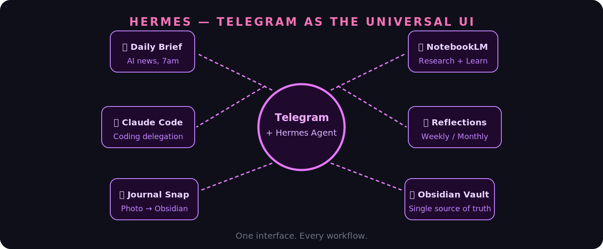
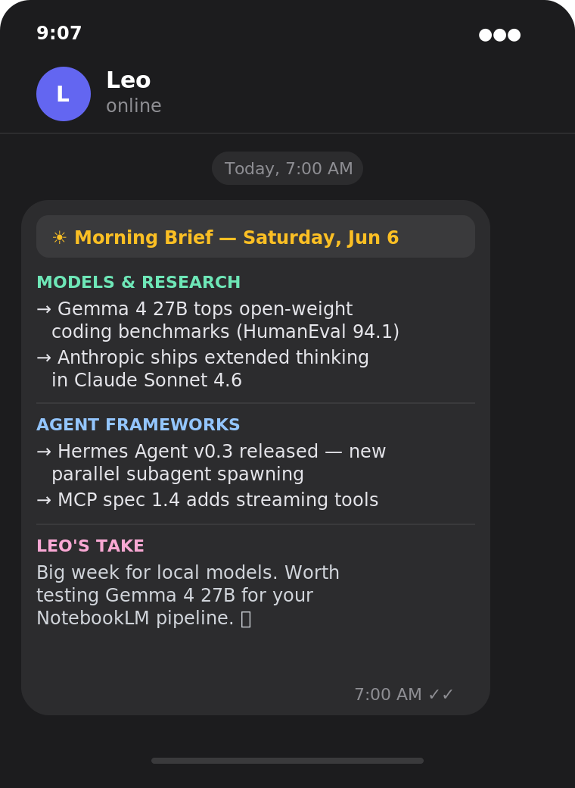
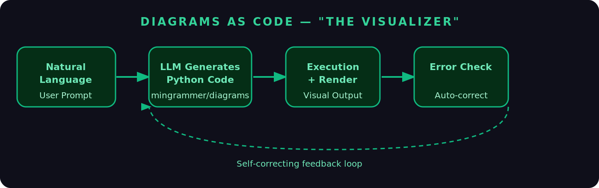
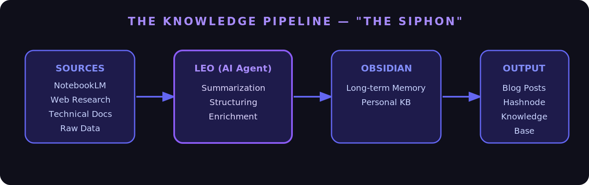
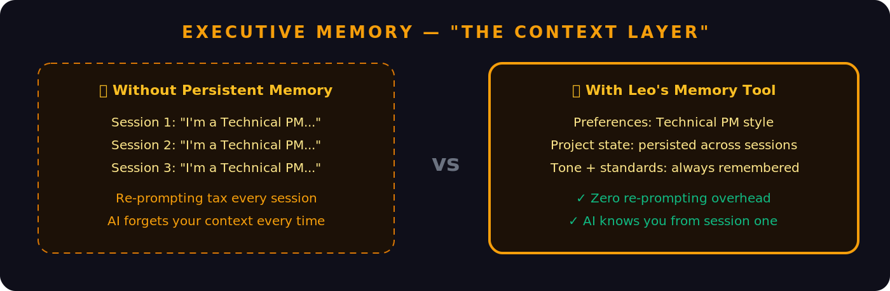

# Leo: My Personal AI Assistant and Second Brain

> *I don't manage Leo. Leo manages things for me.*

---

There's a version of AI that feels like magic, and a version that feels like homework.

The homework version is familiar: open a new chat, re-explain your context, ask a question, get an answer, close the tab. Repeat tomorrow. The AI is smart, but it doesn't know you. Every session starts from zero.

The magic version is what I've been building for the past year. I call it **Leo** — a personal AI assistant and second brain that lives alongside my daily life, not just inside a browser tab.

Leo knows who I am. It remembers what I'm working on. It processes my handwritten journal, keeps my knowledge base in sync, starts my mornings with the right information, and handles the cognitive busywork so I can focus on the thinking that actually matters.

It's not a product. It's a system I've built — and this is how it works.

---

## The Core Idea: A Second Brain That Acts

The concept of a "second brain" — a personal knowledge system that stores and connects your ideas — has been popular for years. Tools like Obsidian, Notion, and Roam are built around it.

But most second brains have a dirty secret: **they require enormous manual effort to maintain**. You have to remember to write things down. You have to tag and link notes yourself. You have to review them regularly or they go stale.

Leo changes this. It's not just a storage system — it's an active participant. It routes information, synthesises patterns, writes notes on my behalf, and surfaces insights I'd otherwise miss. It's the difference between a filing cabinet and a collaborator.

Everything flows through a single interface: **Telegram**. One message, and Leo gets to work — whether that's pulling research, writing code, transcribing my journal, or delivering my morning briefing.



---

## 1. Starting Every Day Right: The Morning AI Brief

I used to start my mornings with Twitter and RSS feeds. I'd spend 20–30 minutes reading, most of it noise, occasionally finding something useful.

Now, before I've opened a browser, **Leo delivers a curated AI briefing to my Telegram at 7am**.

It's filtered specifically for me — model releases, agent frameworks, tools I use, research I care about. Formatted as a tight, scannable brief. Five minutes to read. Zero minutes to compile.



The cumulative effect is significant. Over weeks and months, I've stayed genuinely current in a fast-moving field without the distraction tax of open-ended browsing. I start the day informed and focused, not reactive and scattered.

A good personal assistant doesn't wait to be asked. Leo doesn't either.

---

## 2. Delegating Coding Tasks to Claude Code



When I have a coding task, I used to need to be at my desk, in my IDE, in the right mental mode to execute.

Now I describe what I need to Leo — from anywhere, on my phone — and it delegates to **Claude Code** to handle the implementation.

A real example: *"Write a script that scans my Obsidian vault, finds all notes tagged #reflection from the last 30 days, and generates a weekly summary."*

Leo passes that to Claude Code with the right context. Claude Code writes it, tests it, iterates if something's wrong, and returns the result to Telegram.

The mental model shift here is important: **I'm the architect, Leo and Claude Code are the builders**. I spend my cognitive energy on what to build and why. The execution happens in the background.

For anyone juggling a full-time role alongside side projects and learning, this is a game-changer. Tasks that used to require a focused 90-minute block now happen asynchronously while I'm doing something else.

---

## 3. NotebookLM Integration: Research That Actually Sticks



Deep research has a graveyard problem.

You do meaningful work — read papers, build NotebookLM source collections, generate audio overviews, run queries against your material. Then it sits in a tool you check twice before forgetting about.

Leo connects NotebookLM directly to my Obsidian vault so research actually lands somewhere permanent and useful.

The workflow: I do a deep dive in NotebookLM, then send one message to Leo — *"Structure my NotebookLM session on attention mechanisms into an Obsidian note."* Leo pulls the key insights, formats them with proper headings, tags, and links to related existing notes, and writes the entry directly to my vault.

For active learning, I'll also ask Leo to generate study notes from a session: clean definitions, worked examples, open questions to explore further. The kind of structured note that accelerates understanding rather than just archiving it.

The result: my knowledge base actually reflects what I've learned. It doesn't go stale. It compounds.

---

## 4. My Paper Journal Lives in Obsidian — Without Transcription

This is the workflow that surprises people the most.

I write my journal by hand. On paper, with a pen. The cognitive act of handwriting is qualitatively different from typing — slower, more deliberate, more honest. I'm not giving that up.

But isolated paper journals have a real limitation: they're disconnected from everything else. The reflection I wrote in March doesn't surface when I'm searching for patterns in October.

So I built a bridge. **After writing, I take a photo of the journal page and send it to Leo via Telegram.**

Leo receives the image, extracts the handwritten text via OCR, structures it as a dated, tagged Obsidian note, and writes it to my vault. The whole thing takes about 30 seconds on my end.

What I get: the irreplaceable feel of writing by hand, and the full searchability and connectivity of a digital system. The physical and digital halves of my life, finally integrated.

I didn't realise how much I was losing by keeping them separate until they were connected.

---

## 5. Weekly and Monthly Reflections



The most underrated thing a second brain can do is help you see yourself clearly over time.

We're notoriously bad at this on our own. We remember the emotional peaks and forget the steady progress. We set goals and lose track of them. We repeat the same mistakes without noticing the pattern.

Every week, Leo scans my recent journal entries and Obsidian notes and generates a reflection summary in Telegram. It surfaces recurring themes, tracks progress against goals I've mentioned, flags things I said I'd do but haven't, and notes what seems to be going well.

The monthly version goes deeper — longer arc, more synthesis, direct comparison against the previous month's intentions.

I don't schedule this. I don't have to remember to do it. It just arrives, and I sit with it for 10 minutes.

Over time, this has been the highest-value part of the entire system. Not because Leo is making observations I couldn't make myself — but because it's consistently doing the synthesis I would otherwise skip. **Consistency is where most self-improvement systems fail. Leo makes this one automatic.**

---

## What Ties It All Together

These workflows feel different on the surface — morning news, coding, research, journaling, reflection. But they're all expressions of the same underlying idea.

**Leo is my second brain's active layer.** Obsidian is where knowledge lives. Leo is what keeps it alive — routing information in, surfacing patterns out, handling the logistics so the knowledge base stays current and useful without constant manual maintenance.

A few principles make it work:

**One interface, everywhere.** Everything flows through Telegram. I'm never switching tools or re-establishing context. The complexity lives inside Leo. My side stays simple.

**Leo knows me.** It holds persistent memory of my goals, my projects, my preferences, my writing style. Every session picks up where the last one left off. The re-prompting tax is gone.

**Physical and digital are one system.** The journal workflow is the clearest example: the best personal systems don't force you to choose between analog and digital. They bridge them.

**Automate the handoffs, not the thinking.** The most valuable automation isn't replacing the deep work — it's handling the seams. Research → notes. Notes → drafts. Journal → vault. Observation → reflection. The thinking is mine. The logistics are Leo's.

---

## The Tech Stack: Build Your Own Leo

If you want to replicate this setup, here's exactly what's powering it under the hood.

**The Agent Framework — Hermes Agent (Nous Research)**
Leo is built on **Hermes Agent**, an open-source autonomous agent framework by Nous Research. This is the engine that makes everything work — it handles tool use, memory persistence, scheduling, Telegram integration, and the learning loop that makes Leo smarter over time.

```bash
curl -fsSL https://raw.githubusercontent.com/NousResearch/hermes-agent/main/scripts/install.sh | bash
```

**The Brain — Gemma 4 via Ollama**
Leo runs on **Gemma 4**, served locally through Ollama. The model runs entirely on my machine — no API keys, no usage costs, no data leaving my device. Gemma 4's multimodal capability also handles the journal photo OCR directly.

```bash
ollama run gemma4
```

**The Hardware — Mac Mini M4**
Everything runs on a **Mac Mini M4**. Quiet, always-on, and handles Gemma 4 without breaking a sweat. The M4's unified memory architecture makes local LLM inference genuinely practical at this scale.

**The Interface — Telegram (via Hermes Messaging Gateway)**
Hermes Agent has a built-in messaging gateway that natively connects to Telegram. One config block in `~/.hermes/config.yaml` is all it takes. No custom bot code required.

**How Leo Remembers Me — Two Markdown Files**
Hermes Agent's memory system is elegantly simple: two files stored at `~/.hermes/memories/`. `MEMORY.md` holds Leo's notes about my environment and projects. `USER.md` holds my profile — communication style, preferences, goals. Both are injected into the system prompt at session start. Past conversations are fully searchable via an FTS5 SQLite index.

**Coding Delegation — Claude Code CLI**
For coding tasks, Leo calls the **Claude Code CLI** directly as a subprocess — takes my natural language request, formats it into a precise task, invokes Claude Code, and routes the result back to Telegram.

**Scheduling — Hermes Built-in Cron**
The morning brief and weekly/monthly reflections are configured once in `~/.hermes/config.yaml`. `0 7 * * *` for the daily brief. `0 9 * * 1` for the weekly reflection.

**The Full Stack at a Glance:**

| Layer | Tool |
|---|---|
| Agent Framework | Hermes Agent (Nous Research, open-source) |
| LLM | Gemma 4 (via Ollama, fully local) |
| Hardware | Mac Mini M4 |
| Interface | Telegram (Hermes Messaging Gateway) |
| Memory | MEMORY.md + USER.md + SQLite FTS5 |
| Knowledge Base | Obsidian (Markdown vault) |
| Research | NotebookLM |
| Coding | Claude Code CLI (delegated subprocess) |
| Scheduling | Hermes built-in cron |
| Journal OCR | Gemma 4 multimodal (vision) |

**One important note:** this isn't an application you install — it's a *configuration* of Hermes Agent. The workflows described here are built by connecting Hermes' built-in capabilities — its memory system, its skills, its cron scheduler, its Telegram gateway — and pointing them at the tools and services that matter to you.

---

## Why This Matters

We talk a lot about AI making us more productive. But the real opportunity isn't doing the same things faster. It's building systems that keep working even when you're not — that accumulate knowledge, surface patterns, and handle the cognitive overhead that currently sits between you and the things that matter.

Leo isn't a chatbot I query. It's a system that runs in the background of my life, keeping my second brain healthy, my mornings grounded, and my attention pointed at work worth doing.

We're still early. But the direction is clear: the most valuable AI setups won't be defined by the best model. They'll be defined by the best architecture — persistent memory, tool use, deep integration with the physical and digital threads of your actual life.

Leo is my version of that. And it keeps getting better.

**Want to build your own?** Start with Hermes Agent and Ollama. Install both, run `hermes setup --portal`, connect Telegram, and you have the foundation. The workflows above are yours to adapt.
