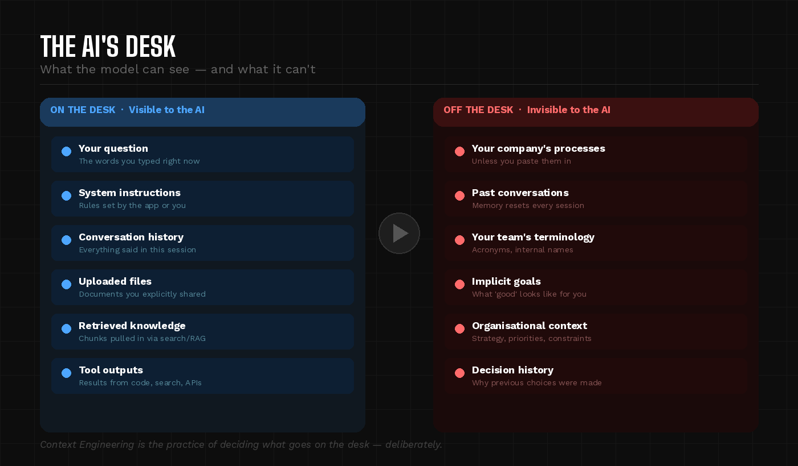
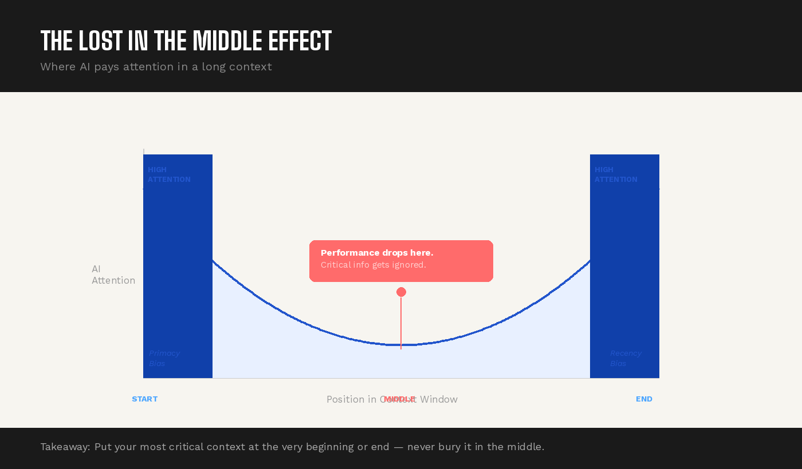
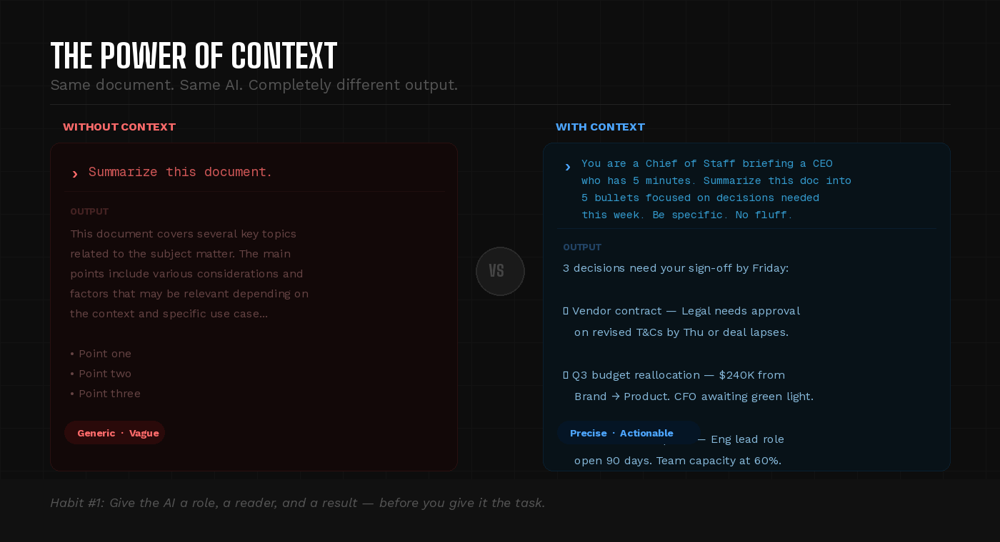

# Context Engineering — The Skill That Separates Good AI Users from Great Ones

*The skill that separates people who get great results from AI — from those who don't.*

---

There's a common misconception about why some people get brilliant results from AI tools like Claude or ChatGPT, while others get generic, frustrating responses.

Most people assume it's about finding the "magic words." Ask the question the right way, and the AI performs. Ask it wrong, and it fails. So they obsess over phrasing — tweaking, re-wording, prompt-hacking.

But that's not what's actually happening.

The people getting consistently great results aren't magicians. They're **librarians**. They understand that the real skill isn't in *asking* — it's in *what you give the AI to work with*.

This is called **Context Engineering**.

---

## What Context Engineering Actually Is

Think of an AI model's "mind" like a desk.

When you send a message, the AI can only see what's on that desk right now. It doesn't remember your last conversation. It doesn't know your company's strategy, your team's terminology, or why this task matters. It only sees what you've placed in front of it.

**Context engineering is the practice of deliberately deciding what goes on that desk.**

Not just your question — but the background, the constraints, the relevant history, the format you want, the tone you need, the decisions already made. The more precisely you curate that desk, the better the AI performs.

Tobi Lütke, CEO of Shopify, put it simply: context engineering is *"the art of providing all the context for the task to be plausibly solvable by the AI."*

---

## Why It Matters More Than You Think

Here's something most people don't realize: **AI models have a hard limit on how much they can process at once.** It's called a context window — think of it as the size of the desk.

And here's the surprising part — more isn't always better.

Dumping everything you can think of into a prompt doesn't help. It actually hurts. Research shows that AI models perform best when information appears at the *beginning* or *end* of what they're given. Anything buried in the middle tends to get lost — a phenomenon researchers call the **"Lost in the Middle"** problem.

There's also a **signal-to-noise** issue. If you paste in 50 pages of documentation when only 3 paragraphs are relevant, the AI has to wade through noise to find the signal. The result: slower, less accurate, more generic responses.

This is why context engineering is a discipline, not just a tip. It requires you to think like an editor — ruthlessly cutting what doesn't matter so what does matter gets full attention.

---

## Three Habits That Separate Good AI Users from Great Ones

### 1. Give the AI a Role and a Reason

Don't just ask a question. Tell the AI who it is, what you're trying to accomplish, and what a good answer looks like.

Instead of: *"Summarize this document."*

Try: *"You're a Chief of Staff preparing a briefing for a CEO who has 5 minutes. Summarize this document into 5 bullet points focused on decisions that need to be made this week."*

Same document. Completely different output.

### 2. Front-load What Matters Most

Because AI models pay the most attention to what comes first, lead with your most important constraints and goals — before the question, before the background, before anything else.

If you need the response in a specific format, say so upfront. If there's a constraint that changes everything ("we can't use vendors outside the EU"), that goes first.

### 3. Prune, Don't Stuff

When working on a complex task over multiple messages, resist the urge to keep adding more context indefinitely. Instead, periodically **summarize what's been decided and delete what's no longer relevant**.

Teams at Anthropic who build AI agents do this formally — they call it "context compaction." The agent pauses, summarizes its progress, and continues with a clean slate. You can do the same manually: "Here's what we've decided so far. Ignore everything before this message."

---

## What This Means for Leaders and Teams

If you manage a team that uses AI tools, context engineering is the highest-leverage skill you can develop — in yourself and your people.

The organizations winning with AI aren't the ones with the fanciest tools. They're the ones who've figured out how to package their institutional knowledge — their processes, their terminology, their decision frameworks — in a way that AI can actually use.

Think of it as **turning your team's tribal knowledge into infrastructure**.

A great onboarding document, a well-structured project brief, a concise set of operating principles — these aren't just useful for new hires anymore. They're the inputs that determine whether your AI tools produce generic output or genuinely useful work.

The teams that invest in this now will have a compounding advantage. Every process they document, every decision framework they articulate, every piece of institutional knowledge they make machine-readable becomes a permanent asset that makes every future AI interaction better.

---

## The Shift in Mindset

Prompt engineering was about finding magic words.

Context engineering is about something more fundamental: **taking responsibility for what the AI knows before it starts.**

It's the difference between handing someone a task with no background and briefing them properly. The AI, like any good collaborator, can only be as good as the information you give it to work with.

The best AI users aren't hoping for a smarter model. They're building better desks.

---

*If you found this useful, the next step is simple: look at the last prompt you sent to an AI tool and ask yourself — what was missing from that desk?*
