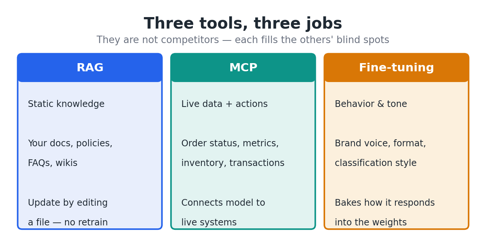
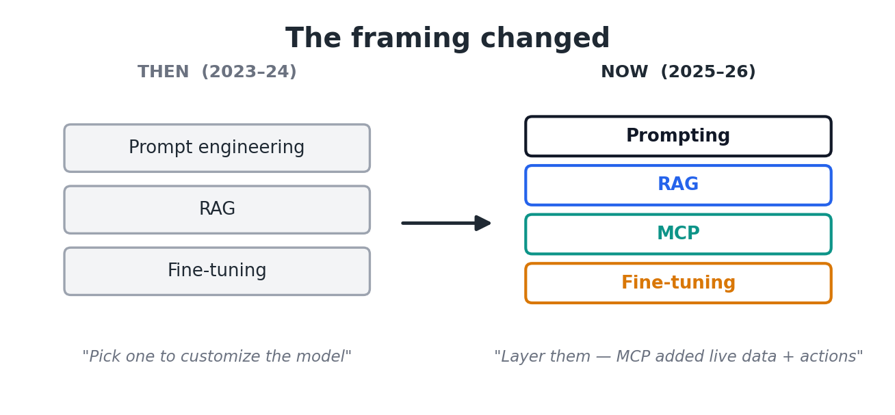
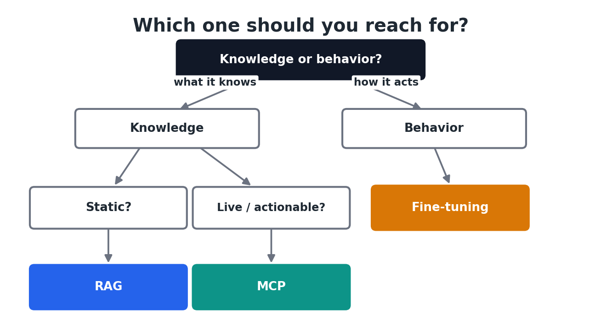

# MCP vs RAG vs Fine-Tuning: How to Actually Choose

A few months ago I watched a team spend three weeks fine-tuning a model so their assistant could answer questions about their product catalog. The day they shipped it, the catalog changed. The model was already out of date — and they'd need to retrain to fix it.

That was the wrong tool. Not because fine-tuning is bad, but because they reached for the most expensive, slowest option to solve a problem the cheapest option handles in an afternoon.

This confusion is everywhere right now. "MCP vs RAG vs fine-tuning" gets framed as a cage match where one technique wins. It isn't. They solve three different problems, and the people who ship reliable AI systems usually use more than one at once. Here's how to tell them apart and choose without burning three weeks on the wrong thing.

**What you'll learn:**

- What each technique actually does — in plain terms
- The one question that tells you which to reach for
- Why the best systems combine all three
- A decision checklist you can apply today

## The problem: your model doesn't know your stuff

Out of the box, a large language model knows a lot about the world and nothing about *you*. It doesn't know your customer's order status, your internal wiki, your return policy, or the tone your support team is supposed to use. Every technique here is a different answer to one question: how do you get your knowledge, your data, and your behavior into a model that was trained on neither?

The three answers differ along three axes — how fresh the data is, how much it costs to set up, and whether you're changing *what the model knows* or *how the model behaves*. Get those straight and the choice mostly makes itself.

## Wait — didn't this used to be prompting vs RAG vs fine-tuning?

If you read about this a year or two ago, the framing was different. The classic 2023–2024 question was **prompt engineering vs RAG vs fine-tuning**: three ways to "customize" a model, and you picked one. Prompt engineering meant getting better answers by writing better instructions and examples — no infrastructure, just words. RAG added your knowledge. Fine-tuning reshaped the model. That was the whole map.

That map has changed, for two reasons.

First, MCP didn't exist yet in any standard form — Anthropic only introduced it in late 2024. Once it became an industry standard in 2025, a whole category that the old framing lumped under "fine-tuning" or hacky custom integrations — *live data and taking actions* — got its own clean answer.

Second, the question itself shifted. The old framing was about *what the model knows*. With the rise of agentic AI, the more important question became *what the model can do* — read a live system, call a tool, complete a task. Prompt engineering didn't go away; it's now the baseline you always do first. But "pick one of three" became "layer four," and MCP is the new piece most people are still slotting in.

## RAG: for knowledge that doesn't change by the second

Retrieval-Augmented Generation is the most common starting point, and for good reason. You take your documents — policies, docs, articles, past tickets — split them into chunks, and convert each chunk into a vector embedding stored in a database. When a user asks something, you embed their question, find the most similar chunks, and paste them into the prompt before the model answers.

The model isn't retrained. It's just handed the right pages at the right moment and asked to answer from them.

This does two valuable things. It grounds answers in real source material, which sharply cuts hallucinations, and it lets you update knowledge by editing a document instead of retraining anything. Change a policy, re-index that file, done.

> 💡 **Tip:** RAG is the right call when "good enough if it's updated daily or weekly" describes your data. Docs, knowledge bases, product manuals, FAQs — anything mostly static and text-heavy.

Where RAG struggles is live data and actions. It can tell a customer what your refund policy *says*. It can't look up whether *their specific order* shipped, because that fact lives in a database that changes by the minute and was never embedded.

## MCP: for live data and taking action

The Model Context Protocol is the newest of the three and the most misunderstood. Anthropic introduced it in late 2024, and within a year it went from one company's experiment to an industry standard — OpenAI adopted it across its products in March 2025, Google DeepMind added it to the Gemini SDK, and Microsoft, AWS, and others followed. It's now governed under the Linux Foundation.

MCP is not a knowledge technique. It's a *connection* standard — a universal adapter between your model and live systems. An AI app (the client) opens a connection to an MCP server that exposes tools and data, and the model can then query live systems or call functions during generation: check an order status, pull current inventory, look up an account, kick off a transaction.

The reason it caught on so fast is boring but important: it kills the N×M integration problem. Before MCP, every AI app needed a custom integration for every tool. MCP standardizes that, so one server works across any MCP-compatible model.

> 💡 **Tip:** Reach for MCP when the model needs to *do* something or read something that's true right now — account data, metrics, inventory, live status. RAG is for what the model should *know*; MCP is for what it should *access and act on*.

The catch is that MCP gives the model real reach into live systems, so permissions, auth, and safety actually matter. A retrieval bug returns a bad paragraph. A tool bug can change real data.

## Fine-tuning: for behavior, not facts

Fine-tuning is the only one of the three that changes the model itself. You continue training it on your own examples so it internalizes a skill, a format, or a tone. Crucially, it's bad at teaching *facts* and good at teaching *behavior*.

If you want a model that reliably writes in your brand voice, follows a strict output structure, classifies tickets the way your team does, or adopts the cadence of clinical documentation — that's fine-tuning. You're shaping *how it thinks and responds*, not *what it knows*.

The cost picture changed a lot recently. Full fine-tuning is genuinely expensive and only justified when the domain shift is extreme and you have tens of thousands of examples. But parameter-efficient methods like LoRA and QLoRA train roughly 1% of the weights and can specialize a model on a single consumer GPU in a few hours for around $10.

> ⚠️ **Warning:** Fine-tuning on a narrow dataset risks *catastrophic forgetting* — the model gets better at your task and worse at everything else. LoRA reduces this risk but doesn't eliminate it. And the moment your underlying facts change, a fine-tuned model is stale, because the knowledge is frozen into the weights.

That's exactly the trap the team from my intro fell into: they used a fact-freezing technique for facts that wouldn't hold still.

## The one question that decides it

Strip away the hype and the choice comes down to what kind of problem you have:

> 📊 **Rule of thumb:** Use **RAG** for what doesn't change minute-to-minute. Use **MCP** for what changes constantly or requires action. Use **fine-tuning** for *how* you want the model to behave.

Mapped to real scenarios:

- "Explain our refund policy" → RAG (static knowledge)
- "Did *my* order ship?" → MCP (live data)
- "Always respond in our support tone and format" → fine-tuning (behavior)
- "Summarize this 40-page contract" → just a bigger context window, none of the above

## The real answer: you'll probably combine them

Here's what the versus framing hides. The most capable systems don't pick one — they layer all three, because each covers the others' blind spots.

Take a healthcare assistant. Fine-tuning teaches it to write in proper clinical tone and follow documentation standards. RAG grounds its answers in your verified medical guidelines so it doesn't invent dosages. MCP pulls the patient's current medication list from a live system. Behavior, knowledge, and live data — three techniques, three jobs, one assistant.

The practical sequence most teams should follow: start with good prompting, add RAG when the model needs your knowledge, add MCP when it needs live data or actions, and fine-tune last — only when prompting and retrieval have stopped moving your evaluation numbers. Fine-tuning first is the most common expensive mistake I see.

## The takeaway

MCP, RAG, and fine-tuning aren't competitors — they're a toolkit, and the only real mistake is using the slow expensive tool for a job the fast cheap one already solves. Knowledge that holds still is RAG. Data that moves or needs action is MCP. Behavior you want baked in is fine-tuning. Almost everything serious uses a mix.

What's your stack looking like — are you layering these, or still fighting the versus framing? I'd love to hear what's working and what isn't.
